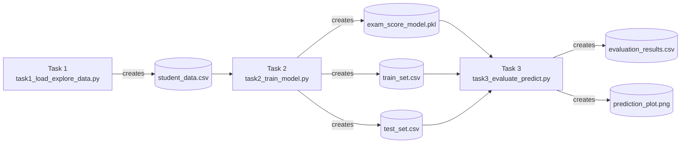
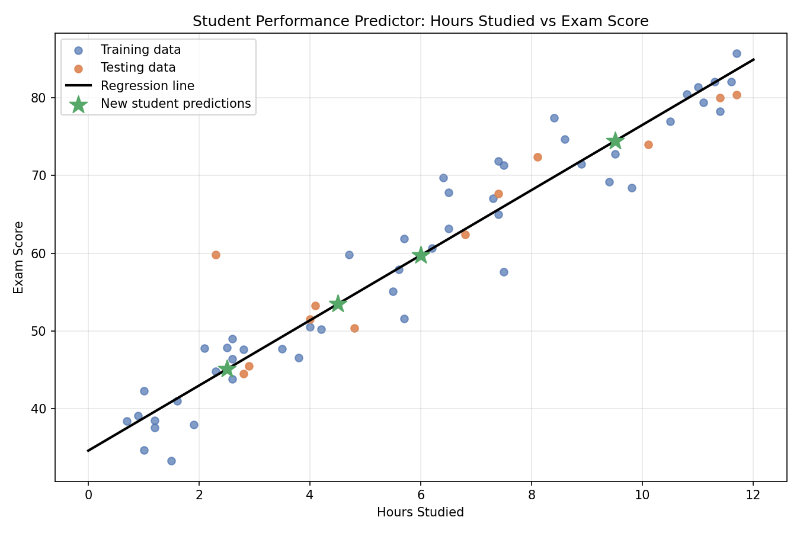

<div align="center">

# 🎓 Student Performance Predictor

A beginner-friendly machine learning project that predicts a student's exam score based on the number of hours they studied, using **Linear Regression**.

Built as part of an internship task at **SoftNexis**.

[](https://www.python.org/)
[](https://pandas.pydata.org/)
[](https://numpy.org/)
[](https://scikit-learn.org/)
[](https://matplotlib.org/)

</div>

---

## 📝 Overview

This project is split into three connected scripts that mirror a real ML workflow:

| Step | Script | What it does |
|------|--------|----------------|
| 1️⃣ | `task1_load_explore_data.py` | Generates a realistic dataset of 60 students, explores it, cleans missing values, and saves it |
| 2️⃣ | `task2_train_model.py` | Loads the dataset, splits it into train/test sets, and trains a Linear Regression model |
| 3️⃣ | `task3_evaluate_predict.py` | Evaluates the model (MAE, R²), compares predictions vs actual scores, predicts scores for new students, and plots the results |

> [!IMPORTANT]
> Each script saves its output to a file that the **next** script loads — so they must be run **in order**, in the same folder.



---

## 📓 Jupyter Notebook

An interactive, step-by-step Jupyter Notebook is available to run and explore the entire machine learning workflow in one place:
* **[Project_1_Student_Performance_Predictor.ipynb](./Project_1_Student_Performance_Predictor.ipynb)**

This notebook combines the dataset generation, model training, evaluation metrics, and the final visualization plot with interactive code blocks and inline outputs.

---

## 📁 Directory Structure

```
Student_Performance_Predictor/
├── Project_1_Student_Performance_Predictor.ipynb  # Interactive Jupyter Notebook
├── task1_load_explore_data.py                     # Step 1: Create & explore the dataset
├── task2_train_model.py                           # Step 2: Train the regression model
├── task3_evaluate_predict.py                      # Step 3: Evaluate model & visualize predictions
├── requirements.txt                               # Python dependencies
└── README.md                                      # You are here
```

**Generated files** (created automatically when you run the scripts — not stored in the repo):

| File | Created by | Used by |
|------|-----------|---------|
| `student_data.csv` | Task 1 | Task 2 |
| `exam_score_model.pkl` | Task 2 | Task 3 |
| `train_set.csv` / `test_set.csv` | Task 2 | Task 3 |
| `evaluation_results.csv` | Task 3 | — |
| `prediction_plot.png` | Task 3 | — |

---

## 🚀 Quick Start & Setup

**1. Clone the repository**
```bash
git clone https://github.com/dhanish0711/student-performance-predictor.git
cd Student_Performance_Predictor
```

**2. (Optional) Create a virtual environment**
```bash
python -m venv venv
source venv/bin/activate      # On Windows: venv\Scripts\activate
```

**3. Install dependencies**
```bash
pip install -r requirements.txt
```

---

## 🏃 How to Run

Run the three scripts **in order** — each one depends on the file saved by the previous step:

```bash
python task1_load_explore_data.py
python task2_train_model.py
python task3_evaluate_predict.py
```

> [!TIP]
> You can also run everything in Google Colab — just upload the three `.py` files (or copy each one into its own cell) and run them top to bottom.

---

## 📊 Results & Visualizations

The trained Linear Regression model achieved the following performance metrics on the test dataset:

| Metric | Value | Interpretation |
| :--- | :--- | :--- |
| **Mean Absolute Error (MAE)** | 3.32 points | On average, predictions deviate by ~3.32 exam points. |
| **R-squared ($R^2$ Score)** | 0.83 | The model explains 83% of the variance in exam scores. |

### 🔮 Sample Test Set Predictions

| Hours Studied | Actual Score | Predicted Score | Residual Error |
| :---: | :---: | :---: | :---: |
| 4.8 | 50.4 | 54.7 | -4.3 |
| 2.3 | 59.8 | 44.3 | +15.5 |
| 4.0 | 51.5 | 51.4 | +0.1 |
| 8.1 | 72.4 | 68.6 | +3.8 |
| 2.9 | 45.5 | 46.8 | -1.3 |
| 7.4 | 67.7 | 65.6 | +2.1 |
| 11.4 | 80.0 | 82.4 | -2.4 |
| 6.8 | 62.4 | 63.1 | -0.7 |
| 10.1 | 74.0 | 76.9 | -2.9 |
| 2.8 | 44.5 | 46.3 | -1.8 |
| 4.1 | 53.3 | 51.8 | +1.5 |
| 11.7 | 80.4 | 83.7 | -3.3 |

### 🚀 Predictions for New Students

- 📝 **2.5 Hours**: **45.1%** predicted score
- 📝 **4.5 Hours**: **53.5%** predicted score
- 📝 **6.0 Hours**: **59.8%** predicted score
- 📝 **9.5 Hours**: **74.4%** predicted score

### 📉 Regression Visualization Plot

The plot below shows the training data, testing data, regression line, and predictions for new students:



---

## 📚 Key Machine Learning Concepts

- **Data Wrangling**: Data generation, exploration, and cleaning with `pandas` and `numpy`.
- **Train/Test Split**: Splitting datasets using `scikit-learn` to prevent overfitting.
- **Linear Regression**: Model training, interpretation of slope (coefficients) & intercept.
- **Model Evaluation**: Evaluating regression accuracy using MAE and R² metrics.
- **Serialization**: Saving and loading trained models using `joblib`.
- **Data Visualization**: Creating plots and regression line overlays with `matplotlib`.

---

Made with ❤️ by [Dhanish Ladwani](https://github.com/dhanish0711)
